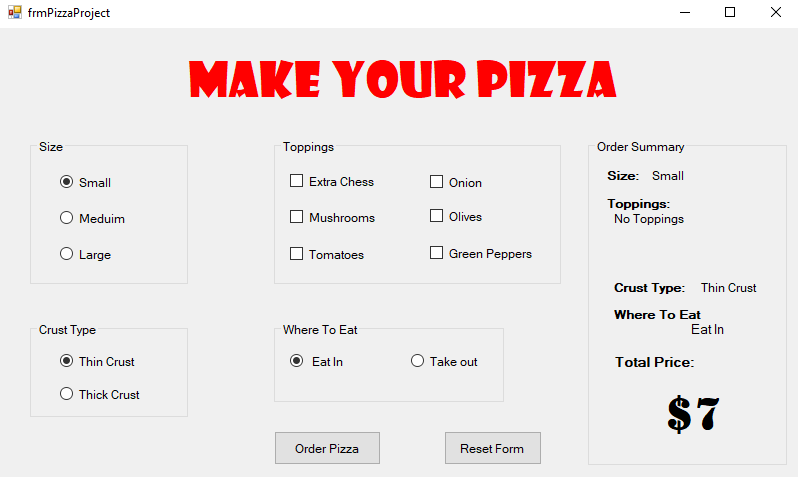
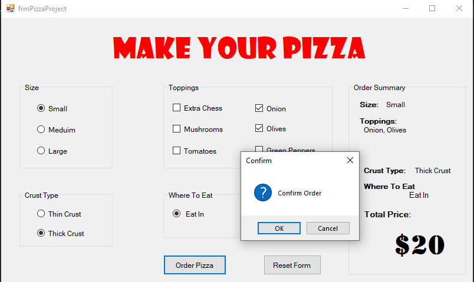

# 🍕 Pizza Order System

<p align="center">


</p>

---

# 📖 Overview

Pizza Order System is a desktop application developed using **C#** and **Windows Forms**.

The application provides a user-friendly interface for customizing pizza orders by selecting size, crust type, toppings, and additional options while automatically calculating the total price.

This project demonstrates GUI development, event-driven programming, and object-oriented programming concepts using the .NET Framework.

---

# ✨ Features

- 🍕 Choose Pizza Size
- 🥖 Select Crust Type
- 🧀 Add Extra Cheese
- 🍄 Add Toppings
- 🌶️ Customize Ingredients
- 🚚 Delivery / Take Away
- 💲 Automatic Price Calculation
- 🔄 Reset Order
- ✅ Confirm Order

---

# 🖥️ Technologies Used

- C#
- .NET Framework
- Windows Forms
- Visual Studio

---

# 📂 Project Structure

```
PizzaProject
│
├── frmPizzaProject.cs
├── frmPizzaProject.Designer.cs
├── Program.cs
├── App.config
├── PizzaProject.csproj
└── Properties
```

---

# 🚀 Getting Started

### Clone the repository

```bash
git clone https://github.com/YourUsername/Pizza-Order-System.git
```

### Open the project

Open the solution using **Visual Studio**.

### Build

Build the solution.

### Run

Press

```
Ctrl + F5
```

or click **Start Without Debugging**.

---

# 📷 Screenshots

<p align="center">
    
    <br>
    <em>Main Application Interface</em>
</p>
<p align="center">
    
    <br>
    <em>Order Summary with Total Price</em>
</p>

# 🎯 Learning Objectives

This project demonstrates:

- Windows Forms Development
- Event-Driven Programming
- Object-Oriented Programming
- GUI Design
- User Interaction
- Real-Time Calculations

---

# 🔮 Future Improvements

- Save Orders to Database
- Customer Management
- Receipt Printing
- Order History
- Multiple Pizza Orders
- Online Ordering
- Payment Integration

---

# 👨‍💻 Author

**Anas Omar**

Backend Developer

---

# ⭐ Support

If you like this project, don't forget to give it a ⭐ on GitHub.
